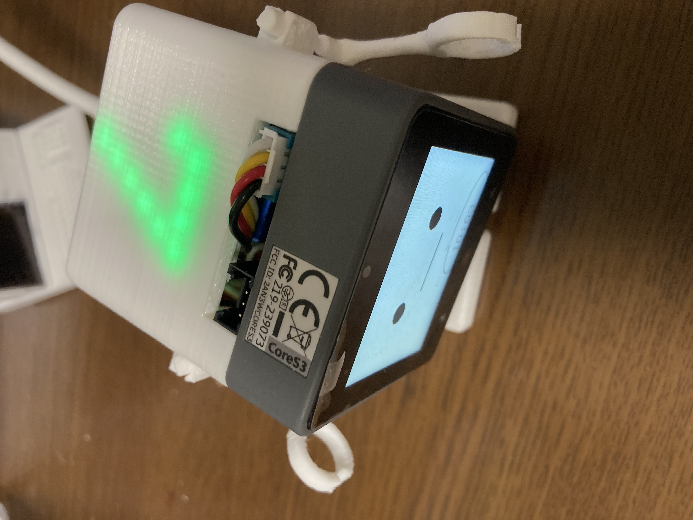

# M5Stack-Stackchan with  function calling

[](https://platformio.org/)



[日本語](README_ja.md)

## Features

You can use HexLED and weather forecast using OpenAI's function calling.
  The coding of function calling is kept simple.

* The original source is the following work by ronron-gh. However, facial recognition is disabled.
  [AI_StackChan2_DevCam](https://github.com/ronron-gh/AI_StackChan2_DevCam)
* Display the time in the speech bubble when silent.
* HexLED control is the code from ronron-gh's work below.
  [AI_StackChan2_FuncCall](https://github.com/ronron-gh/AI_StackChan2_FuncCall)
* Monologue is enabled and fixed in the source code.
* If left unattended, self-talk decreases and eventually shuts down.
* The HexLED display pattern is created using the following tool.
  [HexLED-Editor-for-ronronsan-AI_StackChan2_FuncCall](https://github.com/QtDogBow/HexLED-Editor-for-ronronsan-AI_StackChan2_FuncCall)
* Takao-Base shell is modified to fix HexLED.
  
* Operation confirmed with M5Stack CoreS3.

## install

### Assumptions

* Operation has been confirmed with VSCode 1.90.1, Platform IO.

### Preparation

* Please write the following information in wifi.txt of SD.
  
```sh
WIFI_SSID
WIFI_PASS
```

* Please write the following information in apikey.txt of SD. Weather information is obtained from a free OpenWeather account.
  [OpenWeather](https://openweathermap.org/)

```sh
OPENAI_API_KEY
VOICEVOX_APIKEY
STT_APIKEY
OPENWEATHER_APIKEY
```

## How to use

```sh
To turn on the HexLED, press the area on the forehead and say something like "Light up the LED panel in pattern 7".
Patterns are registered from 0 to 9.

To ask about the weather, press your forehead and say something like, "What's the weather like in Tokyo?"
OpenWeather's free account only answers the current weather in major cities.
```

## How to stop monologue

Please comment out the following line located around the 5th line from the beginning of the loop() function in main.cpp.

```cpp

random_time = MILLIS_MONOLOGUE_SHORT_INTERVAL;//Go to monologue mode.
```

## Note

* It seems that you need to press and hold the power button for a long time to resume after shutdown.
* If you keep talking to yourself on a slippery desk, Stack Chan will fall.
  there is.
* HexLED may be suggested or executed when you are talking to yourself.
  vinegar. This was unexpected.